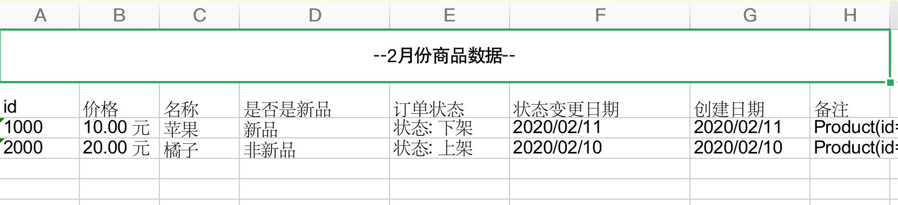

# easy-excel

## 它是什么?

easy-excel 是基于 Apache POI 框架的一款扩展封装小库，让我们在开发中更快速的完成导入导出的需求。 尽管很多人会提出 poi 能干这事儿为什么还要封装一层呢？

easy-excel 很大程度上简化了代码、让使用者更轻松的 读、写 Excel 文档，也不用去关心格式兼容等问题，很多时候我们在代码中会写很多的 for 循环，各种 getXXXIndex 来获取行或列让代码变的更臃肿。多个项目之间打一枪换一个地方，代码 Copy 来 Copy 去十分凌乱， 如果你也在开发中遇到类似的问题，那么 easy-excel 是你值得一试的工具。 

## 特性

**支持:**

- 基于 Java 8 开发
- 简洁的 API 操作
- 注解驱动
- 高性能低损耗
- 可配置列顺序
- 支持数据类型转换
- 自定义导入/导出转换器
- 支持 Excel 2003、2007格式

**不支持将来可能支持:**

- 自定义列样式

- 按模板导出

## 快速开始

### 引入依赖

还没有

### 导出

下面是我们的 Java 模型类，用于存储 Excel 的行数据。

```java
@Data
@AllArgsConstructor
public class Product {
    private Integer id;

    private Long price;

    private OffsetDateTime created;

    private String name;

    private Boolean isNew;

    private StateEnum stateEnum;

    private LocalDateTime updateTime;

    private String other;

}
// 枚举
public enum StateEnum {

    UP(0, "上架"),
    DOWN(1, "下架"),
    NONE(2, "库存不足");

    StateEnum(int code, String name) {
        this.code = code;
        this.name = name;
    }

    /**
     * code
     */
    private int code;
    /**
     * name
     */
    private String name;

    public int getCode() {
        return code;
    }

    public String getName() {
        return name;
    }
}

```

可以看到, Product类中,有枚举,有日期,有基本数据类型,等等.

现在我们要把 Product 导出到Excel,该怎么做呢?

**第一步:** 添加 @ExcelColumn 注解,后面会给出各个参数的意思

```java
@Data
@AllArgsConstructor
public class Product {

    @ExcelColumn(columnName = "id", index = 10)
    private Integer id;
		// 导出时, 把 单位为分的价格转为元
    @ExcelColumn(columnName = "价格", index = 20, centToYuan = true, suffix = " 元")
    private Long price;
		// 日期格式化
    @ExcelColumn(columnName = "创建日期", index = 60,datepattern="yyyy/MM/dd")
    private OffsetDateTime created;

    @ExcelColumn(columnName = "名称", index = 40)
    private String name;
		// Boolean 类型转换
    @ExcelColumn(columnName = "是否是新品", index = 41, trueToStr = "新品", falseToStr = "非新品")
    private Boolean isNew;
		// 枚举序列化控制
    @ExcelColumn(columnName = "订单状态", index = 50, enumKey = "name", prefix = "状态: ")
    private StateEnum stateEnum;

    @ExcelColumn(columnName = "状态变更日期", index = 55)
    private LocalDateTime updateTime;
		// 自定义转换器 ToStringConverter.class
    @ExcelColumn(columnName = "备注", index = 70, writeConverter = ToStringConverter.class)
    private String other;

}
```

**第二步:** 调用 ExcelWriter 类进行导出操作, write() 方法 会返回一个 Workbook 对象

```java

		@Test
    public void testExport() throws IOException {
        Workbook workbook = ExcelWriter.create(ExcelType.XLS)
                .sheetName("商品数据")
                .sheetHeader("--2月份商品数据--")
                .write(products, Product.class);

        File file = new File(productFile);
        OutputStream outputStream = new FileOutputStream(file);
        workbook.write(outputStream);
        outputStream.close();
    }
```

导出表格:



## 导入

拿上面导出的表格为例,进行导入操作

第一步:

给实体类添加注解: @ExcelColumn

```java
@Data
@AllArgsConstructor
public class Product {

    @ExcelColumn(columnName = "id", index = 10)
    private Integer id;

    @ExcelColumn(columnName = "价格", index = 20,  suffix = " 元", yuanToCent = true)
    private Long price;

    @ExcelColumn(columnName = "创建日期", index = 60)
    private OffsetDateTime created;

    @ExcelColumn(columnName = "名称", index = 40)
    private String name;
		// 导入时,把字符串转为 Boolean 值
    @ExcelColumn(columnName = "是否是新品", index = 41,strToFalse = "非新品", strToTrue = "新品")
    private Boolean isNew;
		// 导入时,把字符串转为枚举值
    @ExcelColumn(columnName = "订单状态", index = 50, enumKey = "name", prefix = "状态: ")
    private StateEnum stateEnum;

    @ExcelColumn(columnName = "状态变更日期", index = 55)
    private LocalDateTime updateTime;
		// 自定义导入转换器
    @ExcelColumn(columnName = "备注", index = 70, readConverter =
            MyReadConverter.class)
    private String other;

    // 导入必须有无参构造器
    public Product() {
    }
}
```

**需要注意的是,导入操作,接受的实体类必须有无参构造器,否则不能出入成功**

第二步: 调用 ExcelReader 类的方法

```java
    @Test
    public void testImportXls() throws FileNotFoundException {
        FileInputStream fileInputStream = new FileInputStream(productFile_Xls);
        List<Product> products = ExcelReader
                .read(fileInputStream, ExcelType.XLS)
                .startRowNum(1)
                .to(Product.class);
        Assert.assertNotNull(products);
    }
```


# @ExcelColumn 注解参数

@ExcelColumn注解提供了常用的 转换操作,包括**列名定义,列排序,Boolean值转换,前缀后缀,日期格式化,分转元,元转分** 等等.

对于更加复杂的转换,提供了转换器接口

* **IWriteConverter**: 导出转换器
* **IReadConverter**: 导入转换器

| 参数           | 解释                                                         | 示例 |
| -------------- | ------------------------------------------------------------ | ---- |
| columnName     | xcel 每一列的名称                                            |      |
| index          | 排序(仅对导出有效),支持不连续的整数                          |      |
| datePattern    | 日期格式,默认: yyyy/MM/dd,只支持 OffsetDateTime和 LocalDateTime |      |
| enumKey        | 枚举导入使用的key,序列化枚举使用<br />                       |      |
| trueToStr      | true 转换字符串(仅对导出有效)                                |      |
| strToTrue      | 字符串转 true(仅对导入有效)                                  |      |
| falseToStr     | false 转换(仅对导出有效)                                     |      |
| strToFalse     | 字符串 转 false(仅对导入有效)                                |      |
| prefix         | 前缀                                                         |      |
| suffix         | 后缀                                                         |      |
| centToYuan     | 是否启用 分转元(仅对导出有效) ,仅支持 Integer 和 Long 类型   |      |
| yuanToCent     | 是否启用 元转分(仅对导入有效),仅支持 Integer 和 Long 类型    |      |
| writeConverter | 导出转换器                                                   |      |
| IReadConverter | 导入转换器                                                   |      |


